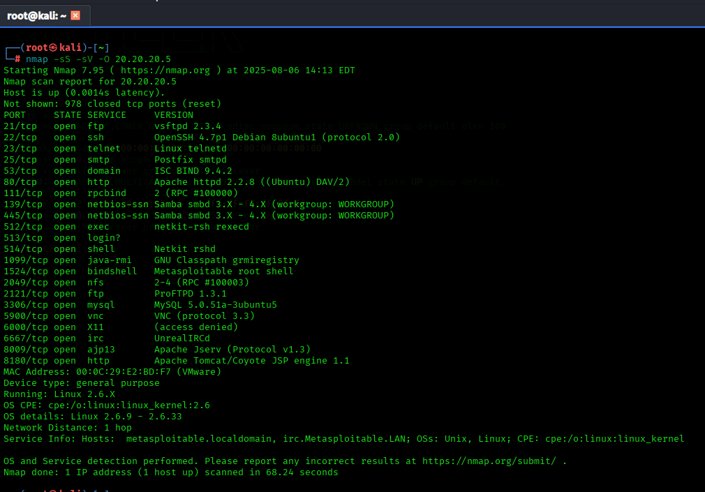
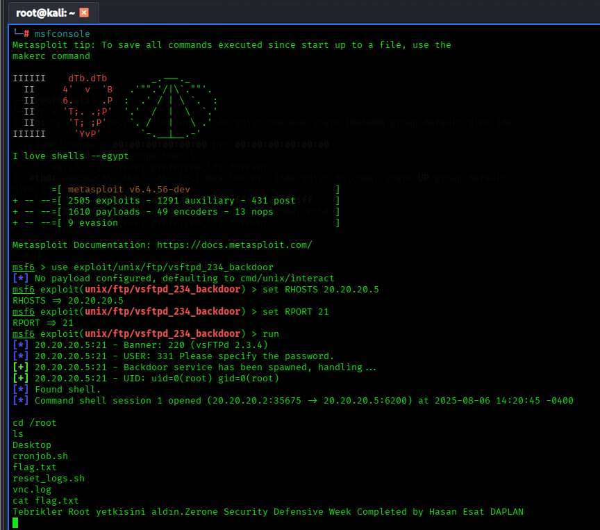

# Attacking Metasploitable 2
Hello,
Today we performed a penetration test on a hardened Metasploitable 2 virtual machine. Before starting the test, we performed a comprehensive Nmap scan of the target machine. During this scan, we detected that some services were open, such as 21/tcp (FTP), 22/tcp (SSH), and 23/tcp (Telnet). The FTP port (21) was particularly noteworthy because anonymous FTP access was enabled on the target system, allowing connection without authentication.



We connected to the FTP service, listed the directories on the system, and were able to access files with user permissions. We then used this vulnerability to run the ```exploit/unix/ftp/vsftpd_234_backdoor```module on the Metasploit Framework. This exploit targets the backdoor vulnerability found in ```VSFTPD```, ```version 2.3.4``` and allows us to open a shell directly on the target system.

After running the exploit, we obtained command execution privileges on the target system as a low-privileged user. After conducting a detailed exploration of the system, we managed to obtain root privileges by using one of the Linux kernel exploits for local privilege escalation. After obtaining root privileges, we proved that we had full access to the target by reading the contents of the flag.txt file on the system.

In the following sections, we have reported all the steps we took in detail with screenshots and command outputs. This report presents the services, ports, exploit modules, shell connection methods, and privilege escalation stages used in this report step by step.



- Although it is easy and quick, preventing security vulnerabilities such as these is very important.
